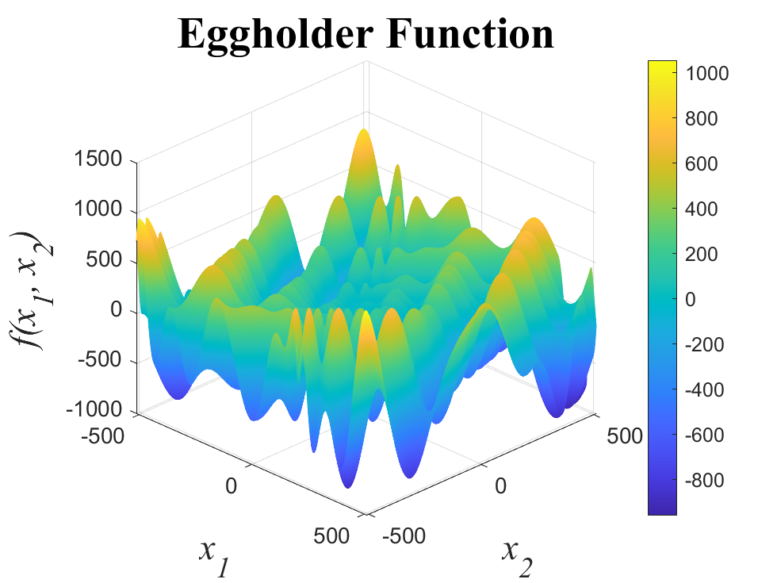
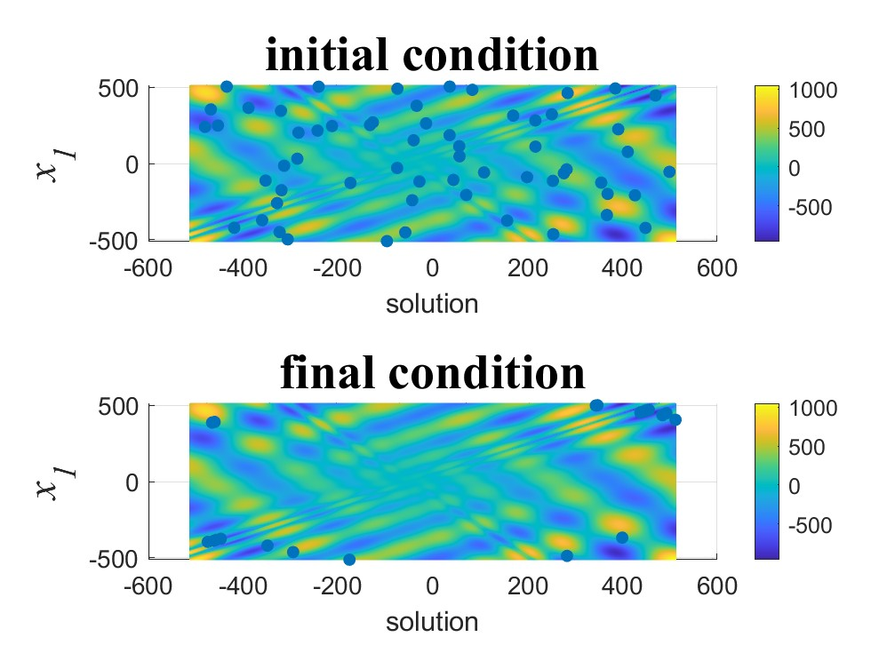
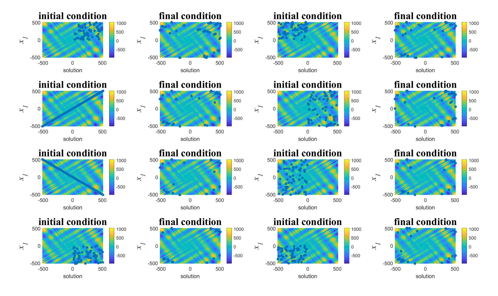
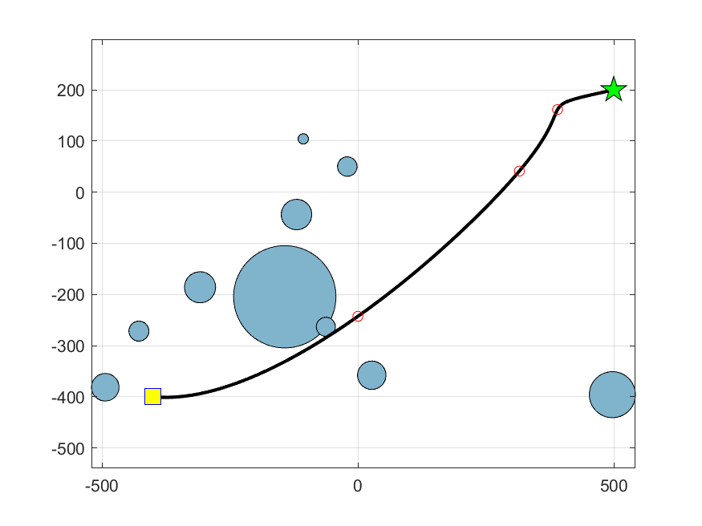

# BS Final Thesis: Benchmarking and Path Planning Optimization

This repository contains the MATLAB implementation and results for the final thesis project, which involves:
1. **Benchmarking various algorithms using the Egg Holder cost function.**
2. **Developing a path planning optimization algorithm to find the shortest collision-free path.**

---

## Visualizations

## Stage one of testing the algorithm implementation

### Egg Holder Function
This 3D visualization represents the Egg Holder cost function used for benchmarking the algorithms.


### Initial vs. Final Conditions for Random Inputs 
The algorithms were tested with random inputs to observe their convergence from initial to final conditions.


### Results for Predefined Inputs
This visualization shows the results for predefined inputs across the tested algorithms.



## Stage two path planning optimization

### Path Planning Optimization
This figure demonstrates the use of one algorithm to compute the shortest collision-free path.



### Path Planning Result Animation
This animation demonstrates the path planning process in action.

### Path Planning Result Animation


---

## Repository Structure

- **BenchMarking_Optimization(Using_EGG_Holder)**: Contains implementations and benchmarking results for the following algorithms:
  - Firefly
  - BFO (Bacterial Foraging Optimization)
  - Electric Fish
  
- **optimization_path_planning**: MATLAB files for optimizing the shortest path avoiding obstacles.

- **EGG_holder_chart**: Visualization results using the Egg Holder cost function.

- **docs**: Includes the thesis document and final presentation slides.
  - `Thesis.pdf`
  - `Presentation.pptx`

- **videos**: Contains the project demonstration video.
  - `Resultanimation_of_pathplanning.mp4`

- **Images**: Contains key visualizations used in the project.

---

## Summary

### Project Objective
To evaluate and compare the performance of five optimization algorithms and utilize them in a robotic path planning scenario to find the shortest collision-free path.

### Algorithms Tested
- Firefly Algorithm
- Bacterial Foraging Optimization (BFO)
- Electric Fish Algorithm
- Imperialist Competitive Algorithm
- Cuckoo Search Algorithm

### Key Insights
1. **Egg Holder Cost Function**:
   - Used to benchmark the performance of each algorithm.
   - Results highlight algorithm efficiency, convergence speed, and accuracy.
   
2. **Path Planning**:
   - The algorithms were applied to a simulated environment to navigate a robot while avoiding obstacles.
   - Results include performance metrics like path length and computation time.

---

## Usage
To run the project:
1. Open MATLAB and navigate to the respective folder.
2. Run the appropriate `.m` files for each algorithm or scenario.
3. View the visualizations and results in the output.

---

## Citation
If you use this repository, please cite it as follows:
```
@project{parham_porkhial_final_thesis_PathPlanning,
  title={A Comparative Study of the Performance of 
Intelligent Algorithms: Cuckoo Search, Electric 
Fish, Firefly, Bacterial Foraging, Imperialist 
Competitive Algorithm in Path Planning
},
  author={Parham Porkhial},
  year={2024},
  organization={Iran university of science and technology}
}
```
